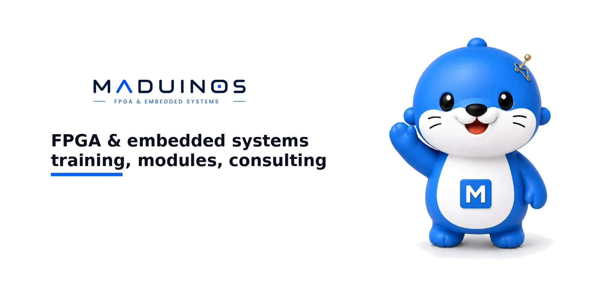

# MADUINOS Biz Web



`maduinos-biz-web`는 MADUINOS 공개 비즈니스 홈페이지를 배포하는 정적 웹 저장소다. GitHub Pages Actions가 검증을 실행한 뒤 `index.html`, `pages`, `assets`, `CNAME`을 `_site` artifact로 묶어 배포한다.

## 현재 포지셔닝

사이트의 브랜드 라인은 `FPGA & EMBEDDED SYSTEMS`이며, 중심 메시지는 `AI/FPGA 교육 및 영상/신호 모듈 제품`이다. 공개 홈은 `제품 라인` 4개를 짧은 카드 구조로 보여주고, 각 관심 영역은 상세 페이지로 연결한다.

- `교육 및 강의`: `FPGA VOD 강의 목차`, `고객 맞춤형 교육`, `고객 보드 Bring-Up`, `Verilog HDL`, `Zynq / Zynq MPSoC`, `LVDS` 중심의 `레벨별 커리큘럼`.
- `FPGA 기반 TDC 모듈`: 기본 16채널, 다이나믹 동작 시 수십채널 가능, USB2.0, 이더넷 100/1000Mbps, UART, CAN 기반 timing capture 모듈.
- `CIS 기반 모듈`: `지폐계수기`, `투표장치`, `공장 라인스캔센서`, `CIS 기반 영상인식이 필요한 모든 고속 장치` 적용 시장과 line scan 기술.
- `ZM4/ZM4MPSoC SoM 모듈`: Zynq7000/ZynqMPSoC, DDR3/DDR4L, QSPI Flash, 고객 맞춤형 사양 기반 모듈.

## 콘텐츠 기준

- 상세 페이지는 `제품 이미지`, `기술 다이어그램`, `상세 스펙`, `어플리케이션 영역` 순서로 구성한다.
- TDC 상세 스펙은 `기본 16채널`, `다이나믹 동작 시 수십채널 가능`, `거리 분해능 4mm`, `최대 거리에 따라 가변`, `거리에 따라 가변 가능`, `USB2.0`, `이더넷 100/1000Mbps`, `UART, CAN`, `5V/12V/24V`, `0°C ~ 65°C`를 포함한다.
- CIS 상세 스펙은 `R/G/B/IR/UV` 조명, scan width, dpi, `16us/line`, `LVDS` capture를 포함한다.
- ZM4 상세 스펙은 `ZM4 / ZM4MPSoC`, `Zynq7000 / ZynqMPSoC`, `DDR3/DDR4L`, `32 MB QSPI Flash`, `48 PS MIO`, `100 FPGA I/O`, `0°C ~ 65°C`, `고객 맞춤형 사양 가능`을 포함한다.
- 교육 상세는 `Verilog HDL`, `Zynq / Zynq MPSoC`, `Zynq7000 초급`, `Zynq7000 중급`, `Zynq7000 고급`, `LVDS`, `고객 보드 Bring-Up` 흐름으로 구성한다.

## 파일 구조

- `index.html`: 메인 페이지
- `404.html`: 존재하지 않는 경로 접근 시 제품 라인으로 안내하는 페이지
- `robots.txt`: 크롤러 허용 및 sitemap 위치 안내
- `sitemap.xml`: 공개 페이지 5개의 검색엔진용 sitemap
- `.github/workflows/deploy-pages.yml`: GitHub Pages Actions 배포 워크플로
- `CNAME`: 커스텀 도메인 `biz.maduinos.com`
- `favicon.ico`: 브라우저 탭용 MADUINOS 아이콘
- `assets/favicon-32.png`: PNG favicon
- `assets/apple-touch-icon.png`: iOS 홈 화면용 아이콘
- `assets/maduinos-biz.css`: 공통 스타일
- `assets/maduinos_wordmark_reference_clean.png`: `FPGA & EMBEDDED SYSTEMS` 라인이 들어간 홈 헤더용 MADUINOS 워드마크
- `assets/maduinos-brand-banner.webp`: 워드마크와 3D 마스코트가 들어간 README용 브랜드 배너
- `assets/mascot-board-presenter.webp`: 메인 문의 섹션용 보드를 든 마스코트 이미지
- `assets/mascot-presenting-hologram.webp`: 교육 상세 페이지 문의 섹션용 강의 마스코트 이미지
- `assets/mascot-thinking.webp`: 404 페이지용 마스코트 이미지
- `assets/tdc-timing-applications.webp`: TDC timing module 어플리케이션 이미지
- `assets/cis-application-markets.webp`: CIS 지폐계수기/투표장치/공장 라인스캔센서 어플리케이션 이미지
- `assets/tdc-cis-lab-system.webp`: TDC/CIS 센서 취득 개발 시스템 이미지
- `assets/edge-ai-carrier-lab.webp`: FPGA carrier 기반 교육/검증 이미지
- `assets/zm4-zm4mpsoc-black-som-module.webp`: ZM4/ZM4MPSoC 검은색 SoM 모듈 이미지
- `assets/og-home.jpg`, `assets/og-tdc.jpg`, `assets/og-cis.jpg`, `assets/og-zm4.jpg`, `assets/og-education.jpg`: 카카오톡/SNS 공유 카드용 1200x630 OG 이미지
- `pages/fpga-education-consulting.html`: 교육 및 강의 상세 페이지
- `pages/tdc-module.html`: FPGA 기반 TDC 모듈 상세 페이지
- `pages/cis-module.html`: CIS 기반 모듈 상세 페이지
- `pages/zm4-module.html`: ZM4/ZM4MPSoC SoM 모듈 상세 페이지
- `pages/ai-edge-vision.html`: 기존 URL 호환용 센서 모듈 안내 페이지
- `pages/fpga-product-poc.html`: 기존 URL 호환용 제품 적용 문의 안내 페이지
- `tools/verify_biz_web.py`: 구조, 문구, 링크, 배포 설정 검증 스크립트

## 공개 메시지 원칙

고객-facing HTML은 글 설명보다 제품 라인 카드, 이미지, 스펙 키워드를 먼저 보여준다.

- 첫 화면에는 교육 및 강의, TDC, CIS, ZM4/ZM4MPSoC 제품 라인을 직접 배치한다.
- 각 제품 상세는 이미지와 다이어그램을 먼저 보여준 뒤 스펙과 적용 시장을 설명한다.
- 문의 동선은 `whjeong@maduinos.com` 메일 주소로 유지한다.
- 고객-facing HTML에는 배포 방식이나 내부 구현을 노출하지 않는다.

## 배포 방향

1. GitHub 저장소 Settings > Pages에서 Source를 GitHub Actions로 설정한다.
2. `main` 브랜치에 push하거나 Actions에서 `Deploy MADUINOS Biz Web to GitHub Pages`를 수동 실행한다.
3. 워크플로는 `python3 tools/verify_biz_web.py`로 구조와 문구를 검증한 뒤 `_site` 디렉터리를 Pages artifact로 배포한다.
4. 첫 화면은 artifact 최상위의 `index.html`이며, 상세 페이지는 `pages/*.html` 경로로 연결된다.

## 검증

```bash
python3 tools/verify_biz_web.py
```

검증은 필수 파일, 공개 포지셔닝 문구, 내부 기획 문구 노출, 민감한 계획 문구 노출, 로컬 링크, GitHub Pages workflow, 한국어 줄바꿈 규칙, 상세 페이지 canonical/OG 메타데이터, sitemap/robots 구성을 확인한다.
